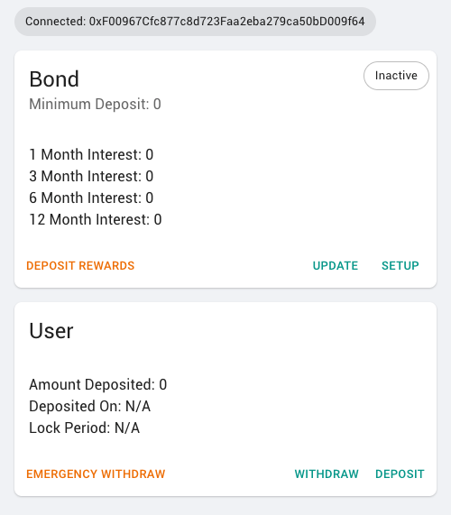

## Install Dependencies

```bash
yarn
```

## Run Application Locally

```bash
yarn start
```

Access the frontend in:
http://localhost:3000/

> User needs to install and connect Metamask to interact with it

## Deploy to Github Pages

```bash
yarn run deploy
```

## Deployed URL

https://kaumidere.github.io/blockchain-developer-bootcamp-final-project/

### Screenshot


